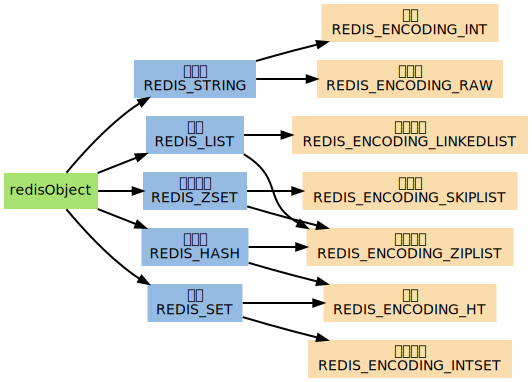

先看一下Redis是一个什么东西。官方简介解释到：Redis是一个基于BSD开源的项目，是一个把结构化的数据放在内存中的一个存储系统，你可以把它作为数据库，缓存和消息中间件来使用。同时支持strings，lists，hashes，sets，sorted sets，bitmaps，hyperloglogs和geospatial indexes等数据类型。它还内建了复制，lua脚本，LRU，事务等功能，通过redis sentinel实现高可用，通过redis cluster实现了自动分片。以及事务，发布/订阅，自动故障转移等等。

综上所述，Redis提供了丰富的功能，初次见到可能会感觉眼花缭乱，这些功能都是干嘛用的？都解决了什么问题？什么情况下才会用到相应的功能？那么下面从零开始，一步一步的演进来粗略的解释下。

1 从零开始

最初的需求非常简单，我们有一个提供热点新闻列表的api：http://api.xxx.com/hot-news，api的消费者抱怨说每次请求都要2秒左右才能返回结果。

随后我们就着手于如何提升一下api消费者感知的性能，很快最简单粗暴的第一个方案就出来了：为API的响应加上基于HTTP的缓存控制 cache-control:max-age=600 ，即让消费者可以缓存这个响应十分钟。如果api消费者如果有效的利用了响应中的缓存控制信息，则可以有效的改善其感知的性能（10分钟以内）。但是还有2个弊端：第一个是在缓存生效的10分钟内，api消费者可能会得到旧的数据；第二个是如果api的客户端无视缓存直接访问API依然是需要2秒，治标不治本呐。

2 基于本机内存的缓存

为了解决调用API依然需要2秒的问题，经过排查，其主要原因在于使用SQL获取热点新闻的过程中消耗了将近2秒的时间，于是乎，我们又想到了一个简单粗暴的解决方案，即把SQL查询的结果直接缓存在当前api服务器的内存中（设置缓存有效时间为1分钟）。后续1分钟内的请求直接读缓存，不再花费2秒去执行SQL了。假如这个api每秒接收到的请求时100个，那么一分钟就是6000个，也就是只有前2秒拥挤过来的请求会耗时2秒，后续的58秒中的所有请求都可以做到即使响应，而无需再等2秒的时间。

其他API的小伙伴发现这是个好办法，于是很快我们就发现API服务器的内存要爆满了。。。

3 服务端的Redis

在API服务器的内存都被缓存塞满的时候，我们发现不得不另想解决方案了。最直接的想法就是我们把这些缓存都丢到一个专门的服务器上吧，把它的内存配置的大大的。然后我们就盯上了redis。。。至于如何配置部署redis这里不解释了，redis官方有详细的介绍。随后我们就用上了一台单独的服务器作为Redis的服务器，API服务器的内存压力得以解决。

3.1 持久化（Persistence）

单台的Redis服务器一个月总有那么几天心情不好，心情不好就罢工了，导致所有的缓存都丢失了（redis的数据是存储在内存的嘛）。虽然可以把Redis服务器重新上线，但是由于内存的数据丢失，造成了缓存雪崩，API服务器和数据库的压力还是一下子就上来了。所以这个时候Redis的持久化功能就派上用场了，可以缓解一下缓存雪崩带来的影响。redis的持久化指的是redis会把内存的中的数据写入到硬盘中，在redis重新启动的时候加载这些数据，从而最大限度的降低缓存丢失带来的影响。

3.2 哨兵（Sentinel）和复制（Replication）

Redis服务器毫无征兆的罢工是个麻烦事。那么怎办办？答曰：备份一台，你挂了它上。那么如何得知某一台redis服务器挂了，如何切换，如何保证备份的机器是原始服务器的完整备份呢？这时候就需要Sentinel和Replication出场了。Sentinel可以管理多个Redis服务器，它提供了监控，提醒以及自动的故障转移的功能；Replication则是负责让一个Redis服务器可以配备多个备份的服务器。Redis也是利用这两个功能来保证Redis的高可用的。此外，Sentinel功能则是对Redis的发布和订阅功能的一个利用。

3.3 集群（Cluster）

单台服务器资源的总是有上限的，CPU资源和IO资源我们可以通过主从复制，进行读写分离，把一部分CPU和IO的压力转移到从服务器上。但是内存资源怎么办，主从模式做到的只是相同数据的备份，并不能横向扩充内存；单台机器的内存也只能进行加大处理，但是总有上限的。所以我们就需要一种解决方案，可以让我们横向扩展。最终的目的既是把每台服务器只负责其中的一部分，让这些所有的服务器构成一个整体，对外界的消费者而言，这一组分布式的服务器就像是一个集中式的服务器一样（之前在解读REST的博客中解释过分布式于基于网络的差异：基于网络应用的架构）。

在Redis官方的分布式方案出来之前，有twemproxy和codis两种方案，这两个方案总体上来说都是依赖proxy来进行分布式的，也就是说redis本身并不关心分布式的事情，而是交由twemproxy和codis来负责。而redis官方给出的cluster方案则是把分布式的这部分事情做到了每一个redis服务器中，使其不再需要其他的组件就可以独立的完成分布式的要求。我们这里不关心这些方案的优略，我们关注一下这里的分布式到底是要处理那些事情?也就是twemproxy和codis独立处理的处理分布式的这部分逻辑和cluster集成到redis服务的这部分逻辑到底在解决什么问题？

如我们前面所说的，一个分布式的服务在外界看来就像是一个集中式的服务一样。那么要做到这一点就面临着有一个问题需要解决：既是增加或减少分布式服务中的服务器的数量，对消费这个服务的客户端而言应该是无感的；那么也就意味着客户端不能穿透分布式服务，把自己绑死到某一个台的服务器上去，因为一旦如此，你就再也无法新增服务器，也无法进行故障替换。解决这个问题有两个路子：第一个路子最直接，那就是我加一个中间层来隔离这种具体的依赖，即twemproxy采用的方式，让所有的客户端只能通过它来消费redsi服务，通过它来隔离这种依赖（但是你会发现twermproxy会成为一个单点），这种情况下每台redis服务器都是独立的，它们之间彼此不知对方的存在；第二个路子是让redis服务器知道彼此的存在，通过重定向的机制来引导客户端来完成自己所需要的操作，比如客户端链接到了某一个redis服务器，说我要执行这个操作，redis服务器发现自己无法完成这个操作，那么就把能完成这个操作的服务器的信息给到客户端，让客户端去请求另外的一个服务器，这时候你就会发现每一个redis服务器都需要保持一份完整的分布式服务器信息的一份资料，不然它怎么知道让客户端去找其他的哪个服务器来执行客户端想要的操作呢。

上面这一大段解释了这么多，不知有没有发现不管是第一个路子还是第二个路子，都有一个共同的东西存在，那就是分布式服务中所有服务器以及其能提供的服务的信息。这些信息无论如何也是要存在的，区别在于第一个路子是把这部分信息单独来管理，用这些信息来协调后端的多个独立的redis服务器；第二个路子则是让每一个redis服务器都持有这份信息，彼此知道对方的存在，来达成和第一个路子一样的目的，优点是不再需要一个额外的组件来处理这部分事情。

Redis Cluster的具体实现细节则是采用了Hash槽的概念，即预先分配出来16384个槽：在客户端通过对Key进行CRC16（key）% 16384运算得到对应的槽是哪一个；在redis服务端则是每个服务器负责一部分槽，当有新的服务器加入或者移除的时候，再来迁移这些槽以及其对应的数据，同时每个服务器都持有完整的槽和其对应的服务器的信息，这就使得服务器端可以进行对客户端的请求进行重定向处理。

4 客户端的Redis

上面的第三小节主要介绍的是Redis服务端的演进步骤，解释了Redis如何从一个单机的服务，进化为一个高可用的、去中心化的、分布式的存储系统。这一小节则是关注下客户端可以消费的redis服务。

4.1 数据类型

redis支持丰富的数据类型，从最基础的string到复杂的常用到的数据结构都有支持：

string：最基本的数据类型，二进制安全的字符串，最大512M。
list：按照添加顺序保持顺序的字符串列表。
set：无序的字符串集合，不存在重复的元素。
sorted set：已排序的字符串集合。
hash：key-value对的一种集合。
bitmap：更细化的一种操作，以bit为单位。
hyperloglog：基于概率的数据结构。

这些众多的数据类型，主要是为了支持各种场景的需要，当然每种类型都有不同的时间复杂度。其实这些复杂的数据结构相当于之前我在《解读REST》这个系列博客基于网络应用的架构风格中介绍到的远程数据访问（Remote Data Access = RDA）的具体实现，即通过在服务器上执行一组标准的操作命令，在服务端之间得到想要的缩小后的结果集，从而简化客户端的使用，也可以提高网络性能。比如如果没有list这种数据结构，你就只能把list存成一个string，客户端拿到完整的list，操作后再完整的提交给redis，会产生很大的浪费。

4.2 事务

上述数据类型中，每一个数据类型都有独立的命令来进行操作，很多情况下我们需要一次执行不止一个命令，而且需要其同时成功或者失败。redis对事务的支持也是源自于这部分需求，即支持一次性按顺序执行多个命令的能力，并保证其原子性。

4.3 Lua脚本

在事务的基础上，如果我们需要在服务端一次性的执行更复杂的操作（包含一些逻辑判断），则lua就可以排上用场了（比如在获取某一个缓存的时候，同时延长其过期时间）。redis保证lua脚本的原子性，一定的场景下，是可以代替redis提供的事务相关的命令的。相当于基于网络应用的架构风格中介绍到的远程求值（Remote Evluation = REV）的具体实现。

4.4 管道

因为redis的客户端和服务器的连接时基于TCP的， 默认每次连接都时只能执行一个命令。管道则是允许利用一次连接来处理多条命令，从而可以节省一些tcp连接的开销。管道和事务的差异在于管道是为了节省通信的开销，但是并不会保证原子性。

4.5 分布式锁

官方推荐采用Redlock算法，即使用string类型，加锁的时候给的一个具体的key，然后设置一个随机的值；取消锁的时候用使用lua脚本来先执行获取比较，然后再删除key。具体的命令如下：

SET resource_name my_random_value NX PX 30000

if redis.call("get",KEYS[1]) == ARGV[1] then
    return redis.call("del",KEYS[1])
else
    return 0
end

总结

本篇着重从抽象层面来解释下redis的各项功能以及其存在的目的，而没有关心其具体的细节是什么。从而可以聚焦于其解决的问题，依据抽象层面的概念可以使得我们在特定的场景下选择更合适的方案，而非局限于其技术细节。


# 一、Redis简介

​	Redis是一个基于单线程的键值对内存数据库，数据库中的键值对由字典保存。每个数据库都有一个对应的字典，这个字典被称之为键空间【key space】。当用户添加一个键值对到数据库时（不论键值对是什么类型）， 程序就将该键值对添加到键空间。

​	字典的键是一个字符串对象。字典的值则可以是包括【字符串（String）、列表（List）、哈希表（Hash）、集合（Set）或有序集（ZSet）】在内的任意一种 Redis 类型对象。

**Redis Object**

```c
/*
 * Redis 对象
 */
typedef struct redisObject {

    // 类型
    unsigned type:4;

    // 对齐位
    unsigned notused:2;

    // 编码方式
    unsigned encoding:4;

    // LRU 时间（相对于 server.lruclock）
    unsigned lru:22;

    // 引用计数
    int refcount;

    // 指向对象的值
    void *ptr;

} robj;
```

`type` 、 `encoding` 和 `ptr` 是最重要的三个属性。

`type` 记录了对象所保存的值的类型，它的值可能是以下常量的其中一个（定义位于 `redis.h`）：

```c
/*
 * 对象类型
 */
#define REDIS_STRING 0  // 字符串
#define REDIS_LIST 1    // 列表
#define REDIS_SET 2     // 集合
#define REDIS_ZSET 3    // 有序集
#define REDIS_HASH 4    // 哈希表
```

`encoding` 记录了对象所保存的值的编码，它的值可能是以下常量的其中一个（定义位于 `redis.h`）：

```c
/*
 * 对象编码
 */
#define REDIS_ENCODING_RAW 0            // 编码为字符串
#define REDIS_ENCODING_INT 1            // 编码为整数
#define REDIS_ENCODING_HT 2             // 编码为哈希表
#define REDIS_ENCODING_ZIPMAP 3         // 编码为 zipmap，Redis2.6后不再使用
#define REDIS_ENCODING_LINKEDLIST 4     // 编码为双端链表
#define REDIS_ENCODING_ZIPLIST 5        // 编码为压缩列表
#define REDIS_ENCODING_INTSET 6         // 编码为整数集合
#define REDIS_ENCODING_SKIPLIST 7       // 编码为跳跃表
```

`ptr` 是一个指针，指向实际保存值的数据结构，这个数据结构由 `type` 属性和 `encoding` 属性决定。



`REDIS_ENCODING_ZIPMAP` 没有出现在图中， 因为从 Redis 2.6 开始， ZIPMAP不再是任何数据类型的底层结构。

**小结：**

- Redis 使用自己实现的对象机制来实现类型判断、命令多态和基于引用计数的垃圾回收。
- 一种 Redis 类型的键可以有多种底层实现。
- Redis 会预分配一些常用的数据对象，并通过共享这些对象来减少内存占用，和避免频繁地为小对象分配内存。

# 二、Redis数据结构及使用场景

## 1、String

​	`REDIS_STRING` （字符串）是 Redis 使用得最为广泛的数据类型，就是普通的 set 和 get，做简单的 KV 缓存。 

[Redis_String详情](https://redisbook.readthedocs.io/en/latest/datatype/string.html)

## 2、Hash

`REDIS_HASH` （哈希表）类似 map 的一种结构，这个一般就是可以将结构化的数据，比如一个对象（前提是**这个对象没嵌套其他的对象**）给缓存在 redis 里，然后每次读写缓存的时候，可以就操作 hash 里的**某个字段**。

```bash
hset person name bingo
hset person age 20
hset person id 1
hget person name

person = {
    "name": "bingo",
    "age": 20,
    "id": 1
}
```

[Redis_Hash详情](https://redisbook.readthedocs.io/en/latest/datatype/hash.html)

## 3、List

list 是有序列表，这个可以玩儿出很多花样。

比如可以通过 list 存储一些**列表型的数据结构**，类似粉丝列表、文章的评论列表之类的东西。

比如可以通过 lrange 命令，读取某个闭区间内的元素，可以基于 list 实现分页查询，这个是很棒的一个功能，基于 redis 实现简单的高性能分页，可以做类似微博那种下拉不断分页的东西，性能高，就一页一页走。

```bash
# 0开始位置，-1结束位置，结束位置为-1时，表示列表的最后一个位置，即查看所有。
lrange mylist 0 -1
```

比如可以搞个简单的消息队列，从 list 头怼进去，从 list 尾巴那里弄出来。

```bash
lpush mylist 1
lpush mylist 2
lpush mylist 3 4 5

# 1
rpop mylist
```

​	**[Redis_List详情](https://redisbook.readthedocs.io/en/latest/datatype/list.htm)**

## 4、Set

set 是无序集合，自动去重。

直接基于 set 将系统里需要去重的数据扔进去，自动就给去重了，如果你需要对一些数据进行快速的全局去重，你当然也可以基于 jvm 内存里的 HashSet 进行去重，但是如果你的某个系统部署在多台机器上呢？得基于 redis 进行全局的 set 去重。

可以基于 set 玩儿交集、并集、差集的操作，比如交集吧，可以把两个人的粉丝列表整一个交集，看看俩人的共同好友是谁。

```bash
#-------操作一个set-------
# 添加元素
sadd mySet 1

# 查看全部元素
smembers mySet

# 判断是否包含某个值
sismember mySet 3

# 删除某个/些元素
srem mySet 1
srem mySet 2 4

# 查看元素个数
scard mySet

# 随机删除一个元素
spop mySet

#-------操作多个set-------
# 将一个set的元素移动到另外一个set
smove yourSet mySet 2

# 求两set的交集
sinter yourSet mySet

# 求两set的并集
sunion yourSet mySet

# 求在yourSet中而不在mySet中的元素
sdiff yourSet mySet
```

​	[Redis_Set详情](https://redisbook.readthedocs.io/en/latest/datatype/set.html)

## 5、Sorted Set【ZSet】

sorted set 是排序的 set，去重但可以排序，写进去的时候给一个分数，自动根据分数排序。

```bash
zadd board 85 zhangsan
zadd board 72 lisi
zadd board 96 wangwu
zadd board 63 zhaoliu

# 获取排名前三的用户（默认是升序，所以需要 rev 改为降序）
zrevrange board 0 3

# 获取某用户的排名
zrank board zhaoliuCopy to clipboardErrorCopied
```

[Redis_ZSet详情](https://redisbook.readthedocs.io/en/latest/datatype/sorted_set.html)

# 三、Redis集群模式

## 1、主从模式


单机的 redis，能够承载的 QPS 大概就在上万到几万不等。对于缓存来说，一般都是用来支撑**读高并发**的。因此架构做成主从(master-slave)架构，一主多从，主负责写，并且将数据复制到其它的 slave 节点，从节点负责读。所有的**读请求全部走从节点**，实现**主从复制，读写分离**，还可以很轻松实现水平扩容，**支撑读高并发**。

主从模式的问题：当从机故障宕机时，redis不能通知客户端哪个节点不可用了，需要手动去更改客户端的配置重新连接，而主机故障宕机时，从机因没有主节点而同步中断，需要人工手动进行故障转移。为了解决这两个问题，在2.8版本之后redis正式提供了sentinel（哨兵）架构。


### 主从复制的核心原理


当启动一个 slave node 的时候，它会发送一个 `PSYNC` 命令给 master node。

如果这是 slave node 初次连接到 master node，那么会触发一次 `full resynchronization` **全量复制**。此时 master 会启动一个后台线程，开始生成一份 `RDB` 快照文件，同时还会将从客户端 client 新收到的所有写命令缓存在内存中。`RDB` 文件生成完毕后， master 会将这个 `RDB` 发送给 slave，slave 会先**写入本地磁盘，然后再从本地磁盘加载到内存**中，接着 master 会将内存中缓存的写命令发送到 slave，slave 也会同步这些数据。slave node 如果跟 master node 有网络故障，断开了连接，会自动重连，连接之后 master node 仅会复制给 slave 部分缺少的数据。

### 主从复制的断点续传

从 redis2.8 开始，就支持主从复制的断点续传，如果主从复制过程中，网络连接断掉了，那么可以接着上次复制的地方，继续复制下去，而不是从头开始复制一份。【**增量复制**】

master node 会在内存中维护一个 backlog，master 和 slave 都会保存一个 replica offset 还有一个 master run id，offset 就是保存在 backlog 中的。如果 master 和 slave 网络连接断掉了，slave 会让 master 从上次 replica offset 开始继续复制，如果没有找到对应的 offset，那么就会执行一次 `resynchronization`**全量复制**。

### 无磁盘化复制

master 在内存中直接创建 `RDB`，然后发送给 slave，不会在自己本地落地磁盘了。只需要在配置文件中开启 `repl-diskless-sync yes` 即可。

```bash
repl-diskless-sync yes

# 等待 5s 后再开始复制，因为要等更多 slave 重新连接过来
repl-diskless-sync-delay 5Copy to clipboardErrorCopied
```

### 过期 key 处理

slave 不会过期 key，只会等待 master 过期 key。如果 master 过期了一个 key，或者通过 LRU 淘汰了一个 key，那么会模拟一条 del 命令发送给 slave。


**[更多Redis主从模式信息](https://doocs.github.io/advanced-java/#/docs/high-concurrency/redis-master-slave)**


## 2、哨兵模式


哨兵模式是主从模式的故障自动转移版本，由Sentinel节点定期监控集群节点是否出现了故障，当主节点出现故障时，由Redis Sentinel自动完成故障发现和转移，并通知应用方，实现高可用性。若主机下线了，则会在所有从机中选出一个作为【新主机】，下线的主机再次上线时，会自动转为【新主机】的从机。

**哨兵的功能：**

- 集群监控：负责监控 redis master 和 slave 进程是否正常工作。
- 消息通知：如果某个 redis 实例有故障，那么哨兵负责发送消息作为报警通知给管理员。
- 故障转移：如果 master node 挂掉了，会自动转移到 slave node 上。
- 配置中心：如果故障转移发生了，通知 client 客户端新的 master 地址。

哨兵用于实现 redis 集群的高可用，本身也是分布式的，作为一个哨兵集群去运行，互相协同工作。

- 故障转移时，判断一个 master node 是否宕机了，需要大部分的哨兵都同意才行，涉及到了分布式选举的问题。
- 即使部分哨兵节点挂掉了，哨兵集群还是能正常工作的。


[**redis-哨兵模式详细**](https://doocs.github.io/advanced-java/#/docs/high-concurrency/redis-sentinel)


## 3、分布式集群


​	redis主从或哨兵模式的每个实例都是**全量存储所有数据**，浪费内存且有木桶效应。为了最大化利用内存，可以采用分布式集群【Redis-Cluster】，就是分布式存储，集群将数据分片存储，每组节点存储一部分数据，从而达到分布式集群的目的。

​	上图是主从模式与分布式集群模式的区别，redis分布式集群中数据是和槽（slot）挂钩的，其总共定义了**16384个槽**，所有的数据根据一致性哈希算法会被映射到这16384个槽中的某个槽中；另一方面，这16384个槽是按照设置被分配到不同的redis节点上。

​	但分布式集群模式会直接导致访问数据方式的改变，比如客户端向A节点发送GET命令但该数据在B节点，redis会返回重定向错误给客户端让客户端再次发送请求，这也直接导致了必须在相同节点才能执行的一些高级功能（如Lua、事务、Pipeline）无法使用。另外还会引发数据分配的一致性hash问题可以参看[这里](https://github.com/crossoverJie/JCSprout/blob/master/MD/Consistent-Hash.md)。

## 4、集群选择

1. 分布式集群的优势在于高可用，将写操作分开到不同的节点，如果写的操作较多且数据量巨大，且不需要高级功能则可能考虑分布式集群。
2. 哨兵的优势在于高可用，支持高级功能，且能在读的操作较多的场景下工作，所以在绝大多数场景中是适合的，缺点是占用内存较大。
3. 主从的优势在于支持高级功能，且能在读的操作较多的场景下工作，但无法保证高可用，不建议在数据要求严格的场景下使用。

# 四、Redis使用策略

## 1、延迟加载

读：当读请求到来时，**先从缓存读，如果读不到就从数据库读，读完之后同步到缓存且添加过期时间。**
写：当写请求到来时，**只写数据库，如mysql。**

优点：仅对请求的数据进行一段时间的缓存，没有请求过的数据就不会被缓存，节省缓存空间；节点出现故障并不是致命的，因为可以从数据库中得到。
缺点：缓存数据可能不是最新的，存在【缓存击穿】、【缓存失效】问题。

## 2、直写

读：当读请求到来时，**只从缓存读。**
写：当写请求到来时，**先写数据库然后同步到缓存，设置为永不过期。**

优点：缓存数据永不过时且为最新。
缺点：每次写入都需要写缓存导致的性能损失；重启节点或故障会导致缓存数据的丢失直到有写操作同步到缓存；大量数据可能没有被读取到，造成资源浪费。

# 五、Redis过期策略

## 1、内存淘汰机制

redis 内存淘汰机制有以下几个：

- noeviction: 不淘汰。当内存不足以容纳新写入数据时，新写入操作会报错，这个一般没人用吧，实在是太恶心了。
- **allkeys-lru**：当内存不足以容纳新写入数据时，在**键空间**中，移除最近最少使用的 key（这个是**最常用**的）。
- allkeys-random：当内存不足以容纳新写入数据时，在**键空间**中，随机移除某个 key，这个一般没人用吧，为啥要随机，肯定是把最近最少使用的 key 给干掉啊。
- volatile-lru：当内存不足以容纳新写入数据时，在**设置了过期时间的键空间**中，移除最近最少使用的 key（这个一般不太合适）。
- volatile-random：当内存不足以容纳新写入数据时，在**设置了过期时间的键空间**中，**随机移除**某个 key。
- volatile-ttl：当内存不足以容纳新写入数据时，在**设置了过期时间的键空间**中，有**更早过期时间**的 key 优先移除。即优先移除即将过期的key。

## 2、手写一个 LRU 算法

你可以现场手写最原始的 LRU 算法，那个代码量太大了，似乎不太现实。

不求自己纯手工从底层开始打造出自己的 LRU，但是起码要知道如何利用已有的 JDK 数据结构实现一个 Java 版的 LRU。

```java
import java.util.HashMap;
import java.util.LinkedList;

class LRUCache {
    //保存key和值
    private HashMap<Integer, Integer> cacheMap = new HashMap<>();
    /**
    *在此对key进行最近最少使用淘汰，只保存key
    *新添加的key或新被访问的key放到链表尾部，超过容量时，移除链表第一个key
    */
    private LinkedList<Integer> recentlyList = new LinkedList<>();
    
    //链表的最大容量
    private int capacity;
	
    public LRUCache(int capacity) {
        //需要手动指定容量大小
        this.capacity = capacity;
    }
	
    //访问一个key
    public int get(int key) {
        //若需要访问的key不存在，则返回-1
        if (!cacheMap.containsKey(key)) {
            return -1;
        }
        //若key存在
        //1、先从链表中删除该key，因为不知道该key在链表中的顺序
        recentlyList.remove((Integer) key);
        //2、又将该key添加到链表的尾部
        recentlyList.add(key);
        
        //从map中返回该key的对应的value
        return cacheMap.get(key);
    }

    //添加一个key
    public void put(int key, int value) {
        //若该key已存在，则说明此次操作是修改
        if (cacheMap.containsKey(key)) {
            //移除掉链表中的key，后面再添加，保证最近被访问的key总是在链表的尾部
            recentlyList.remove((Integer) key);
            
        //若容量已满，则移除链表中的第一个key，并移除对应的map元素 
        }else if(cacheMap.size() == capacity){
            cacheMap.remove(recentlyList.removeFirst());
        }
        //将新加入的key放到链表尾部
        recentlyList.add(key);
        //更新或添加key和value
        cacheMap.put(key, value);
    }

    public static void main(String[] args) {
        LRUCache2 cache = new LRUCache2(2);
        cache.put(1, 1);
        cache.put(2, 2);
        System.out.println(cache.get(1)); // returns 1
        cache.put(3, 3); // 驱逐 key 2
        System.out.println(cache.get(2)); // returns -1 (not found)
        cache.put(4, 4); // 驱逐 key 1
        System.out.println(cache.get(1)); // returns -1 (not found)
        System.out.println(cache.get(3)); // returns 3
        System.out.println(cache.get(4)); // returns 4
    }
}
```

# 六、Redis缓存问题

## 1、缓存击穿

​	**缓存击穿：**查询一个数据库中不存在的数据，比如商品详情，查询一个不存在的ID，每次都会访问DB，如果有人恶意破坏，很可能直接对DB造成过大地压力。

​	**解决办法：**当通过某一个key去查询数据的时候，如果对应key在数据库中的数据都不存在，则我们应将此key对应的value设置为一个默认的值，存在缓存中，避免对数据库的重复查询。

## 2、缓存失效

​	**缓存失效：**在高并发的环境下，如果此时key对应的缓存失效【过时】，则多个进程就会去同时去查询DB，然后再去同时设置缓存。这个时候如果这个key是系统中的热点key或者同时失效的数量比较多时，DB访问量会瞬间增大，造成过大的压力。

​	**解决办法：**将系统中key的缓存失效时间均匀地错开。

## 3、缓存雪崩

​	对于系统 A，假设每天高峰期每秒 5000 个请求，本来缓存在高峰期可以扛住每秒 4000 个请求，但是缓存机器意外发生了全盘宕机。缓存挂了，此时 1 秒 5000 个请求全部落数据库，数据库必然扛不住，它会报一下警，然后就挂了。此时，如果没用什么特别的方案来处理这个故障，DBA 很着急，重启数据库，但是数据库立马又被新的流量给打死了。这就是缓存雪崩。

**解决办法：**

- 事前：保证redis 高可用，主从+哨兵或redis cluster集群，避免全盘崩溃。
- 事中：本地 ehcache 缓存 + hystrix 限流&降级，避免 MySQL 被打死。
- 事后：redis 持久化，一旦重启，自动从磁盘上加载数据，快速恢复缓存数据。

[**缓存雪崩及其应对方法**](https://doocs.github.io/advanced-java/#/docs/high-concurrency/redis-caching-avalanche-and-caching-penetration?id=%E7%BC%93%E5%AD%98%E9%9B%AA%E5%B4%A9)

## 4、热点key

​	缓存中的某些Key(可能对应用与某个促销商品)对应的value存储在集群中一台机器，使得所有流量涌向同一机器，造成系统性能瓶颈，该问题的挑战在于它无法通过增加机器容量来解决。

1. 客户端热点key缓存：将热点key对应的value缓存在客户端本地，并且设置一个失效时间。
2. 将热点key分散为多个子key，然后存储到缓存集群的不同机器上，这些子key对应的value都和热点key是一样的。

# 七、Redis持久化

- **RDB：**

  RDB 持久化可以在指定的时间间隔内生成数据集的时间点快照（point-in-time snapshot）。

  生成时间策略：

  - **save 900 1**：1写操作/900s，生成一次快照
  - **save 300 10** ：10写操作/300s，生成一次快照
  - **save 60 10000**​：10000写操作/60s，生成一次快照

- **AOF：**

  ​	AOF 持久化记录服务器执行的所有写操作命令，并在服务器启动时，通过重新执行这些命令来还原数据集。 AOF 文件中的命令全部以 Redis 协议的格式来保存，新命令会被追加到文件的末尾。 Redis 还可以在后台对 AOF 文件进行重写（rewrite），使得 AOF 文件的体积不会超出保存数据集状态所需的实际大小。

  AOF日志记录策略：

  - **appendfsync no**：等操作系统进行数据缓存同步到磁盘。【快，不安全，数据丢失量大】
  - **appendfsync always**：每次更新数据都同步。【慢，安全，严重损耗性能】
  - **appendfsync everysec**：每秒同步一次。【折中，只会丢失1s的数据】

- **两者同时存在时如何选择**

  ​	Redis 还可以同时使用 AOF 持久化和 RDB 持久化。 在这种情况下， 当 Redis 重启时， 它会优先使用 AOF 文件来还原数据集， 因为 AOF 文件保存的数据集通常比 RDB 文件所保存的数据集更完整。

  ​	但实际上持久化会对Redis的性能造成非常严重的影响，如果一定需要保存数据，那么数据就不应该依靠缓存来保存，建议使用其他方式如mysql数据库。所以Redis的持久化意义不大。


# 八、Redis与memcached的区别

## 1、redis 支持复杂的数据结构

redis 相比 memcached 来说，拥有更多的数据结构，能支持更丰富的数据操作。

redis能支持五大数据结构及其相关操作，而memcached只支持简单的key-value字符串。

## 2、redis 原生支持集群模式

在 redis3.x 版本中，便能支持 cluster 模式，而 memcached 没有原生的集群模式，需要依靠客户端来实现往集群中分片写入数据。

## 3、性能对比

由于 redis 只使用单核【单线程】，而 memcached 可以使用多核【多线程】，所以平均每一个核上 redis 在存储小数据时比 memcached 性能更高。而在 100k 以上的数据中，memcached 性能要高于 redis，虽然 redis 最近也在存储大数据的性能上进行优化，但是比起 memcached，还是稍有逊色。

# 九、缓存与面试

[**缓存细节及其面试套路**](https://doocs.github.io/advanced-java/#/README?id=%E7%BC%93%E5%AD%98)


# Redis的这八个问题，验证你是否精通！

## 1、为什么使用Redis

分析:博主觉得在项目中使用redis，主要是从两个角度去考虑:性能和并发。当然，redis还具备可以做分布式锁等其他功能，但是如果只是为了分布式锁这些其他功能，完全还有其他中间件(如zookpeer等)代替，并不是非要使用redis。因此，这个问题主要从性能和并发两个角度去答。
回答:如下所示，分为两点
（一）性能
如下图所示，我们在碰到需要执行耗时特别久，且结果不频繁变动的SQL，就特别适合将运行结果放入缓存。这样，后面的请求就去缓存中读取，使得请求能够迅速响应。


题外话：忽然想聊一下这个迅速响应的标准。其实根据交互效果的不同，这个响应时间没有固定标准。不过曾经有人这么告诉我:"在理想状态下，我们的页面跳转需要在瞬间解决，对于页内操作则需要在刹那间解决。另外，超过一弹指的耗时操作要有进度提示，并且可以随时中止或取消，这样才能给用户最好的体验。"
那么瞬间、刹那、一弹指具体是多少时间呢？
根据《摩诃僧祗律》记载
一刹那者为一念，二十念为一瞬，二十瞬为一弹指，二十弹指为一罗预，二十罗预为一须臾，一日一夜有三十须臾。
那么，经过周密的计算，一瞬间为0.36 秒,一刹那有 0.018 秒.一弹指长达 7.2 秒。
（二）并发
如下图所示，在大并发的情况下，所有的请求直接访问数据库，数据库会出现连接异常。这个时候，就需要使用redis做一个缓冲操作，让请求先访问到redis，而不是直接访问数据库。

## 2、使用Redis有什么缺点
分析:大家用redis这么久，这个问题是必须要了解的，基本上使用redis都会碰到一些问题，常见的也就几个。
回答:主要是四个问题
(一)缓存和数据库双写一致性问题
(二)缓存雪崩问题
(三)缓存击穿问题
(四)缓存的并发竞争问题
这四个问题，我个人是觉得在项目中，比较常遇见的，具体解决方案，后文给出。

## 3、单线程的Redis为什么这么快
分析:这个问题其实是对redis内部机制的一个考察。其实根据博主的面试经验，很多人其实都不知道redis是单线程工作模型。所以，这个问题还是应该要复习一下的。
回答:主要是以下三点

(一)纯内存操作

(二)单线程操作，避免了频繁的上下文切换

(三)采用了非阻塞I/O多路复用机制

题外话：我们现在要仔细的说一说I/O多路复用机制，因为这个说法实在是太通俗了，通俗到一般人都不懂是什么意思。博主打一个比方：小曲在S城开了一家快递店，负责同城快送服务。小曲因为资金限制，雇佣了一批快递员，然后小曲发现资金不够了，只够买一辆车送快递。

经营方式一:

客户每送来一份快递，小曲就让一个快递员盯着，然后快递员开车去送快递。慢慢的小曲就发现了这种经营方式存在下述问题
几十个快递员基本上时间都花在了抢车上了，大部分快递员都处在闲置状态，谁抢到了车，谁就能去送快递
随着快递的增多，快递员也越来越多，小曲发现快递店里越来越挤，没办法雇佣新的快递员了
快递员之间的协调很花时间

综合上述缺点，小曲痛定思痛，提出了

经营方式二:

小曲只雇佣一个快递员。然后呢，客户送来的快递，小曲按送达地点标注好，然后依次放在一个地方。最后，那个快递员依次的去取快递，一次拿一个，然后开着车去送快递，送好了就回来拿下一个快递。
对比上述两种经营方式对比，是不是明显觉得第二种，效率更高，更好呢。在上述比喻中:

每个快递员------------------>每个线程

每个快递-------------------->每个socket(I/O流)

快递的送达地点-------------->socket的不同状态

客户送快递请求-------------->来自客户端的请求

小曲的经营方式-------------->服务端运行的代码

一辆车---------------------->CPU的核数

于是我们有如下结论
1、经营方式一就是传统的并发模型，每个I/O流(快递)都有一个新的线程(快递员)管理。
2、经营方式二就是I/O多路复用。只有单个线程(一个快递员)，通过跟踪每个I/O流的状态(每个快递的送达地点)，来管理多个I/O流。
下面类比到真实的redis线程模型，如图所示


参照上图，简单来说，就是。我们的redis-client在操作的时候，会产生具有不同事件类型的socket。在服务端，有一段I/0多路复用程序，将其置入队列之中。然后，文件事件分派器，依次去队列中取，转发到不同的事件处理器中。
需要说明的是，这个I/O多路复用机制，redis还提供了select、epoll、evport、kqueue等多路复用函数库，大家可以自行去了解。
可以参考：《为什么说Redis是单线程的？》
## 4、Redis的数据类型，以及每种数据类型的使用场景

分析：是不是觉得这个问题很基础，其实我也这么觉得。然而根据面试经验发现，至少百分八十的人答不上这个问题。建议，在项目中用到后，再类比记忆，体会更深，不要硬记。基本上，一个合格的程序员，五种类型都会用到。
回答：一共五种
(一)String
这个其实没啥好说的，最常规的set/get操作，value可以是String也可以是数字。一般做一些复杂的计数功能的缓存。
(二)hash
这里value存放的是结构化的对象，比较方便的就是操作其中的某个字段。博主在做单点登录的时候，就是用这种数据结构存储用户信息，以cookieId作为key，设置30分钟为缓存过期时间，能很好的模拟出类似session的效果。
(三)list
使用List的数据结构，可以做简单的消息队列的功能。另外还有一个就是，可以利用lrange命令，做基于redis的分页功能，性能极佳，用户体验好。
(四)set
因为set堆放的是一堆不重复值的集合。所以可以做全局去重的功能。为什么不用JVM自带的Set进行去重？因为我们的系统一般都是集群部署，使用JVM自带的Set，比较麻烦，难道为了一个做一个全局去重，再起一个公共服务，太麻烦了。
另外，就是利用交集、并集、差集等操作，可以计算共同喜好，全部的喜好，自己独有的喜好等功能。
(五)sorted set
sorted set多了一个权重参数score,集合中的元素能够按score进行排列。可以做排行榜应用，取TOP N操作。另外，参照另一篇《分布式之延时任务方案解析》，该文指出了sorted set可以用来做延时任务。最后一个应用就是可以做范围查找。
可以参考：《Redis常见的5种不同的数据类型详解》
## 5、Redis的过期策略以及内存淘汰机制

分析:这个问题其实相当重要，到底redis有没用到家，这个问题就可以看出来。比如你redis只能存5G数据，可是你写了10G，那会删5G的数据。怎么删的，这个问题思考过么？还有，你的数据已经设置了过期时间，但是时间到了，内存占用率还是比较高，有思考过原因么?
回答:
redis采用的是定期删除+惰性删除策略。
为什么不用定时删除策略?
定时删除,用一个定时器来负责监视key,过期则自动删除。虽然内存及时释放，但是十分消耗CPU资源。在大并发请求下，CPU要将时间应用在处理请求，而不是删除key,因此没有采用这一策略.
定期删除+惰性删除是如何工作的呢?
定期删除，redis默认每个100ms检查，是否有过期的key,有过期key则删除。需要说明的是，redis不是每个100ms将所有的key检查一次，而是随机抽取进行检查(如果每隔100ms,全部key进行检查，redis岂不是卡死)。因此，如果只采用定期删除策略，会导致很多key到时间没有删除。
于是，惰性删除派上用场。也就是说在你获取某个key的时候，redis会检查一下，这个key如果设置了过期时间那么是否过期了？如果过期了此时就会删除。
采用定期删除+惰性删除就没其他问题了么?
不是的，如果定期删除没删除key。然后你也没即时去请求key，也就是说惰性删除也没生效。这样，redis的内存会越来越高。那么就应该采用内存淘汰机制。
在redis.conf中有一行配置
# maxmemory-policy volatile-lru
该配置就是配内存淘汰策略的(什么，你没配过？好好反省一下自己)
1）noeviction：当内存不足以容纳新写入数据时，新写入操作会报错。应该没人用吧。
2）allkeys-lru：当内存不足以容纳新写入数据时，在键空间中，移除最近最少使用的key。推荐使用，目前项目在用这种。
3）allkeys-random：当内存不足以容纳新写入数据时，在键空间中，随机移除某个key。应该也没人用吧，你不删最少使用Key,去随机删。
4）volatile-lru：当内存不足以容纳新写入数据时，在设置了过期时间的键空间中，移除最近最少使用的key。这种情况一般是把redis既当缓存，又做持久化存储的时候才用。不推荐
5）volatile-random：当内存不足以容纳新写入数据时，在设置了过期时间的键空间中，随机移除某个key。依然不推荐
6）volatile-ttl：当内存不足以容纳新写入数据时，在设置了过期时间的键空间中，有更早过期时间的key优先移除。不推荐
ps：如果没有设置 expire 的key, 不满足先决条件(prerequisites); 那么 volatile-lru, volatile-random 和 volatile-ttl 策略的行为, 和 noeviction(不删除) 基本上一致。
可以参考：《关于缓存命中率的几个关键问题！》
## 6、Redis和数据库双写一致性问题

分析:一致性问题是分布式常见问题，还可以再分为最终一致性和强一致性。数据库和缓存双写，就必然会存在不一致的问题。答这个问题，先明白一个前提。就是如果对数据有强一致性要求，不能放缓存。我们所做的一切，只能保证最终一致性。另外，我们所做的方案其实从根本上来说，只能说降低不一致发生的概率，无法完全避免。因此，有强一致性要求的数据，不能放缓存。
回答:《分布式之数据库和缓存双写一致性方案解析》给出了详细的分析，在这里简单的说一说。首先，采取正确更新策略，先更新数据库，再删缓存。其次，因为可能存在删除缓存失败的问题，提供一个补偿措施即可，例如利用消息队列。
可以参考：《分布式之数据库和缓存双写一致性方案解析！》
## 7、如何应对缓存穿透和缓存雪崩问题

分析:这两个问题，说句实在话，一般中小型传统软件企业，很难碰到这个问题。如果有大并发的项目，流量有几百万左右。这两个问题一定要深刻考虑。
回答:如下所示
缓存穿透，即黑客故意去请求缓存中不存在的数据，导致所有的请求都怼到数据库上，从而数据库连接异常。
解决方案:
(一)利用互斥锁，缓存失效的时候，先去获得锁，得到锁了，再去请求数据库。没得到锁，则休眠一段时间重试
(二)采用异步更新策略，无论key是否取到值，都直接返回。value值中维护一个缓存失效时间，缓存如果过期，异步起一个线程去读数据库，更新缓存。需要做缓存预热(项目启动前，先加载缓存)操作。
(三)提供一个能迅速判断请求是否有效的拦截机制，比如，利用布隆过滤器，内部维护一系列合法有效的key。迅速判断出，请求所携带的Key是否合法有效。如果不合法，则直接返回。
缓存雪崩，即缓存同一时间大面积的失效，这个时候又来了一波请求，结果请求都怼到数据库上，从而导致数据库连接异常。
解决方案:
(一)给缓存的失效时间，加上一个随机值，避免集体失效。
(二)使用互斥锁，但是该方案吞吐量明显下降了。
(三)双缓存。我们有两个缓存，缓存A和缓存B。缓存A的失效时间为20分钟，缓存B不设失效时间。自己做缓存预热操作。然后细分以下几个小点
I 从缓存A读数据库，有则直接返回
II A没有数据，直接从B读数据，直接返回，并且异步启动一个更新线程。
III 更新线程同时更新缓存A和缓存B。
可以参考：《缓存雪崩、缓存穿透、缓存预热、缓存更新、缓存降级等问题！》

## 8、如何解决Redis的并发竞争key问题

分析:这个问题大致就是，同时有多个子系统去set一个key。这个时候要注意什么呢？大家思考过么。需要说明一下，博主提前百度了一下，发现答案基本都是推荐用redis事务机制。博主不推荐使用redis的事务机制。因为我们的生产环境，基本都是redis集群环境，做了数据分片操作。你一个事务中有涉及到多个key操作的时候，这多个key不一定都存储在同一个redis-server上。因此，redis的事务机制，十分鸡肋。
回答:如下所示
(1)如果对这个key操作，不要求顺序
这种情况下，准备一个分布式锁，大家去抢锁，抢到锁就做set操作即可，比较简单。
(2)如果对这个key操作，要求顺序
假设有一个key1,系统A需要将key1设置为valueA,系统B需要将key1设置为valueB,系统C需要将key1设置为valueC.
期望按照key1的value值按照 valueA-->valueB-->valueC的顺序变化。这种时候我们在数据写入数据库的时候，需要保存一个时间戳。假设时间戳如下
系统A key 1 {valueA 3:00}
系统B key 1 {valueB 3:05}
系统C key 1 {valueC 3:10}
那么，假设这会系统B先抢到锁，将key1设置为{valueB 3:05}。接下来系统A抢到锁，发现自己的valueA的时间戳早于缓存中的时间戳，那就不做set操作了。以此类推。
其他方法，比如利用队列，将set方法变成串行访问也可以。总之，灵活变通。
